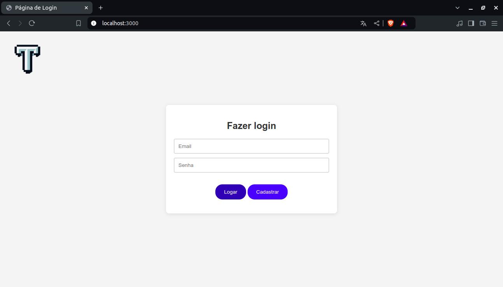

<h1 align="center">Sistema de autenticação de usuário simples</h1>

  &nbsp;
  

  Este é um sistema simples de autenticação de usuários construído com <strong>Node.js</strong>, <strong>Express</strong> e <strong>PostgreSQL</strong>. O sistema inclui funcionalidades básicas de cadastro e login de usuários, além de hash de senhas usando <strong>bcrypt</strong>.

### ✔️ Status de Desenvolvimento

  

### ⚙️ Funcionalidades

- **Cadastro de Usuários**: Permite que novos usuários se registrem com um nome, email, data de nascimento e senha.
- **Login de Usuários**: Permite que usuários registrados façam login com seu email e senha.
- **Hash de Senhas**: Utiliza bcrypt para garantir que as senhas sejam armazenadas de forma segura.
- **Verificação do Nível da Senha**: Garante uma senha forte durante o cadastro.

### 🛠️ Tecnologias Utilizadas

- **Node.js**: Plataforma de runtime para construir o backend.
- **Express**: Framework para Node.js que simplifica o desenvolvimento do servidor.
- **PostgreSQL**: Sistema de banco de dados relacional para armazenar informações dos usuários.
- **bcrypt**: Biblioteca para hashing seguro de senhas.

### ⚡ Telas

#### • Tela de Login

  

#### • Tela de Cadastro

  

### 🚀 Próximas Implementações

- **Validação de Email**: Adicionar verificação para garantir que o formato do email seja válido e possivelmente usar um serviço de verificação de email.

